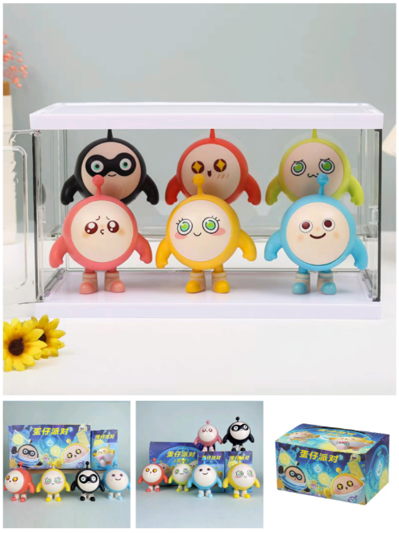

### 先给大家看下我的蛋仔手办
- 
-   
- 怎么样？漂亮吧？是不是超萌超可爱？
### 给大家介绍一下蛋仔
- 上面的手办是我最近正在玩的一个蛋仔排队游戏
- 游戏里面的蛋仔形象有很多，上面六个就是其中的一部分
## 蛋仔的经典语录
- 蛋仔说的话最出名的就得是那句“鸡蛋鸭蛋荷包蛋”了，这是小蛋仔有事儿没事儿一直挂在嘴边的；还有我的小啾啾也是，初次听到蛋仔说“咔咔，我的小啾啾”，还以为它在说我的小舅舅闹了好大一个乌龙；还有“金币金币！搞蛋搞蛋！eggy”，还有“略略略略略略”，以及“嗯...你继续说，我在听”。
## 比赛的时候
- 蛋仔说话还会根据比赛情况进行改变，就比如竞赛大部分玩家已经到了玩家还没到蛋仔一般都会说搞快点，搞快点。一轮录取人数快满只剩下几个名额或者倒计时快要结束蛋仔又会说来不及了，来不及了。真的又搞笑又可爱。
## 和我一起来玩吧
- 我的蛋仔名字叫“圆圆的城宝”，上线和我一起玩吧！