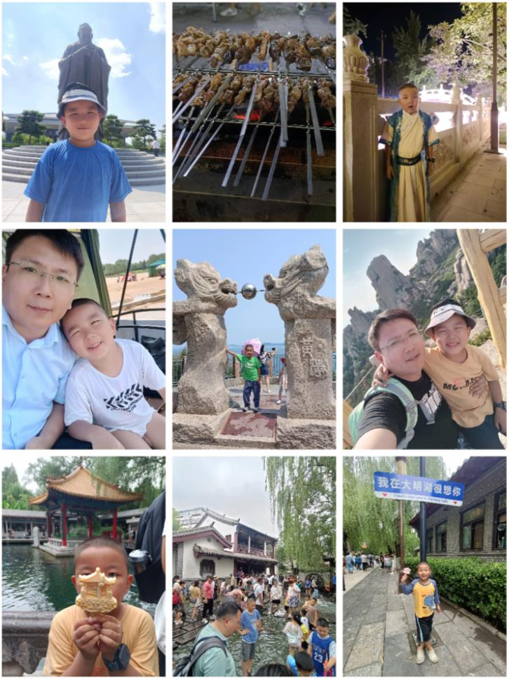

## 我和爸爸和山东半岛环行游记
- 上次的日志说到我和爸爸计划山东半岛环游，我们回来啦，爸爸一共
- 请了十二天的假期，除去准备工作两天，我们有9天在山东，最后一
- 天还和爸爸回了趟老家探望爷爷奶奶还有曾祖父，真是一个充实的
- 假期呢！下面就和我一起回顾一下我们的山东之旅吧！
### 第一站————曲阜
- 我和爸爸的第一站，选择了孔子老前辈的故乡曲阜，我们在他老人家
- 的故乡一共呆了两天，第一天，我们去了孔府、孔庙，孔府是之前孔
- 子和家人们居住的地方，孔庙是后世祭拜孔子的地方。第二天，我和
- 爸爸还去了孔子博物馆。在博物馆里，我和爸爸了解了孔子的生平、
- 智慧及不凡的一生，对他老人家很是钦佩。
### 第二站————淄博
- 我和爸爸的第二站，选择了前几个月大火的淄博，我们是下午逛完孔
- 子博物馆后出发去淄博的，到酒店的时候已经晚上7点多了，我们肚子
- 饿得咕咕叫，赶紧找了一个地方去品尝淄博烧烤，我和爸爸点了有猪
- 五花、牛肉、羊肉各10串，两包淄博小饼，还有一些素菜和饮料，这
- 顿饭吃得那叫一个过瘾啊，酒足饭饱后，我们还步行去了周村古商
- 城，雾气腾腾的古商城的护村河里，好像仙景一样，里面的建筑都已
- 经好几百年了，我还和商城中一个点心铺的叔叔探讨了一下养鱼的事
- 情呢，哈哈！
- 美美的睡了一觉后，我和爸爸第二天去了当地一个文昌湖的景点，这
- 个景点我可是玩美了呢，我在人造的沙滩戏水、爸爸在一旁帮我抓
- 鱼，沙子很细很软，也捉到了好多条小鱼。
### 第三站————蓬莱
- 我和爸爸第三站到了蓬莱，到蓬莱后已经是晚上了，我和爸爸出去找
- 饭吃，然后就吃到了这次旅行中最难忘的一餐，简直太难吃了，虽然
- 点了六七十元的菜，但我和爸爸是一口没吃下去，无奈的回酒店吃泡
- 面了。好在第二天在5A景点蓬莱阁玩得不错，景点儿内的海鲜也好
- 吃，蓬莱小面也很美味。更难得的是在这个景点里有礁石区，而且下
- 午四点多落大潮，我和爸爸第一次踩在海水里欢快的赶海，抓到了很
- 多的小螃蟹和海螺呢
### 第四站————青岛
- 我和爸爸的第四站是青岛，这一站的经历还是挺糟糕的，先是去5A景
- 点崂山爸爸还没爬山呢就摔了一跤，晚上去流清河沙滩赶海，结束后
- 我们的电车小粉却找不到了。本来计划在青岛多呆两天的，后来我们
- 也没心情了，就直接返程并去了我们行程最后一站————济南
### 第五站————济南
- 我和爸爸到济南酒店的时候接近傍晚，鉴于在蓬莱和青岛吃得并不是
- 特别如意，我们这次找到酒店当地的阿姨问询，哈哈，问了才知道，
- 就在酒店隔壁就有吃的，我们一品尝，不得了，太好吃了，而且价格
- 便宜，种类繁多。这家叫超意兴的饭店口号很霸气：一日三餐都在超
- 意兴，比在家里做还划算。没有体验之前我和爸爸都以为老板在吹
- 牛，但我们体验后一下子就被折服了，我们在济南的一日三餐真的就
- 在这一家吃的，而且是心甘情愿。三顿饭一共花了100元刚出头。太棒
- 的体验了。
- 第二天，我和爸爸去了当地知名的景点趵突泉，参观了位于其中的李
- 清照纪念堂，还买了我们这次旅行中的一个纪念品————琉璃双葫芦摆
- 件，之前在淄博的时候就知道淄博博山盛产琉璃，但没有能去看看，
- 在趵突泉的文创室里看到了，毫不犹豫的把她做为了这次旅行的纪念
- 品，来为我们这次的旅行划上圆满的句号。
- 第三天早上，我和爸爸一大早又去了大明湖景区，逛吃逛吃了两个多
- 小时，才匆匆的赶回酒店退房，济南之行太完美了。
## 游玩总结
- 山东是一个很值得游玩的省份，这里的人很好，景也很好，有山有
- 海，但其中有些地方譬如蓬莱、青岛给人的体验其实很一般，吃得也
- 不好，酒店体验也一般。特别是对于喜欢赶海的小孩子，可能更近的
- 海边，或者旅游业不那么发达的海边玩得更美一些。
- 山东的淄博、济南是值得再次去而且多呆些日子的地方，这里政通人
- 和，景点可玩性高，吃得好，可方面的体验都非常棒。如果明年再和
- 爸爸出来玩，我们一定要在这里多呆些日子游玩，心向往并期待着。
## 用一张旅行组图来结束这篇文章吧。期待2024年的旅行！
- 
-   
