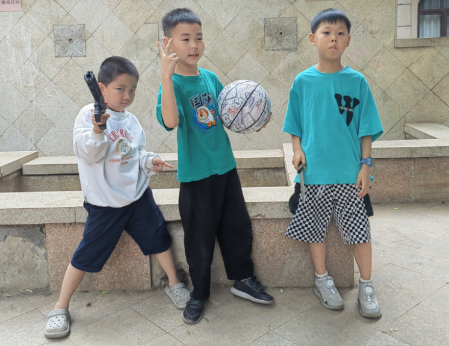

### 完美的周末
- 在刚刚过去的周六周日
- 我度过了一个完美的周末
- 周五晚上的时候我就早早的完成了大部分的书面作业
- 然后在周六的时候到我的朋友糖糖家里玩了一整天
- 晚饭过后又看了《蓝色星球》第二季的第四集
- 每个周六是我们家固定的电影日
- 我从《蓝色星球》第一季开始看到现在第二季都快要结束了
- 我特别喜欢海洋，喜欢片子中让人惊叹的海底世界
- 第二天周日我和爸爸又乘坐公交车来到了水族市场
- 给家里的热带缸和锦鲤缸又增加了新成员
- 中午的时候顺道到了琪琪哥和桃子妹妹家里一起玩
- 奶奶炸得油条和菜角很美味
- 大爷给的冰激淋很超好吃
- 当然我和琪琪哥和桃子妹妹一起玩游戏也玩得好开心
- 带着鱼儿们回到家放到缸中后
- 爸爸骑车又把我送到禾琪家玩到天黑
- 哈哈哈哈——真是一个完美的周末啊
- 
-   
